## گزارش پروژه‌ی پیاده‌سازی یک وب‌سرور 

برای پیاده‌سازی این پروژه ابتدا زبان go انتخاب شد. کتابخانه‌ی کار با سوکت این زبان مفصل و غنی و سرراست است. برای پیاده‌سازی قسمت کار با شبکه به طور عمده از کتابخانه‌ی net استفاده گردید، برای قسمت‌های ارسال فایل و reader و writer از os و path و bufio نیز استفاده شد.

چالش اولی که وجود داشت این بود که با تلاش برای باز کردن پورت ۸۰، برنامه دچار مشکل می‌شد. پس از [جست‌وجو](https://serverfault.com/a/112798) به این نتیجه رسیدیم که در سیستم عامل لینوکس برای باز کردن پورت های کوچکتر مساوی ۱۰۲۴ نیاز به دسترسی سوپریوزر است، برای این منظور دو چاره اندیشیده شد، اول اینکه زمانی که این خطا نمایش داده می‌شود، به کاربر می‌گوییم که باید از sudo استفاده کند و در واقع راهکار مناسب ارائه می‌شود. مورد دوم، امکان راه‌اندازی سرور روی پورت دیگری غیر از ۸۰ است، برای تنظیم این مورد توسط کاربر از commandline argument استفاده شد که در زبان گو به صورت پیش‌فرض با کتابخانه flag می‌توان از کاربر ورودی دریافت کرد.

نحوه اتصال کانکشن های جدید به این شکل است که یک حلقه در ترد اصلی برنامه در حال اجرا و منتظر است، منتظر به این معنی که متد Accept روی listener به شکل بلاکینگ منتظر اتصال جدید می‌ماند. زمانی که کلاینتی متصل شود یک کانکشن ساخته می‌شود و هندلر مربوط به آن اجرا می‌شود. هر هندلر به شکل هم‌روند با ترد اصلی اجرا می‌شود تا در صورتی که همزمان دو کاربر متصل شدند همچنان امکان پاسخگویی حفظ شود. برای این منظور از گو روتین (با کلیدواژه‌ی go) استفاده شد. هر روتین هم پس از اتمام ارسال و دریافت پیام کارش تمام می‌شود و می‌میرد.

تا اینجا دانستیم که به ازای هر کلاینت جدیدی که متصل می‌شود، یک گو روتین ساخته می‌شود و هندلر مربوطه اجرا می‌شود، در این هندلر لاگ مربوط به کانکشن جدید و منبع آن چاپ می‌شود. برای لاگ زدن از کتابخانه لاگ زبان استفاده شد، در زمان لاگ زدن زمان وقوع لاگ هم نوشته می‌شود. هر شی کانکشن (که به هندلر خود پاس می‌شود) دارای متد Read و Write است اما به شکل مستقیم با آن‌ها کار نمی‌کنیم، بلکه از ساختارهایی کمک می‌گیریم که به شکل راحت‌تر و بافر شده عملیات خواندن و نوشتن را انجام دهند. (مثلا bufio)

ابتدا یک استراکت از نوع HttpRequest از اسکنری که روی connection بسته شده پر می‌شود (متد CreateRequest)

در این متد ابتدا سطر اول خوانده می‌شود که شامل متد مربوطه و مسیر خواسته‌شده است. در سطرهای بعدی درخواست هدر ها قرار دارند ولی با توجه به محدود بودن کاربر برنامه ما، نیازی به خواندن آن ها نیست و در نظر گرفته نمی‌شوند. همچنین متدهای غیر از Get نیز خطا دریافت می‌کنند.

در همین متد، یک regex مسئول بررسی صحت سطرهاست و در صورتی که مطابق استاندارد نباشند خطای ۴۰۰ برمی‌گردد.

مرحله بعدی که می‌توان گفت منطق سرور است، یک استراکت HttpResponse از روی درخواست مربوطه ساخته می‌شود. با توجه به مسیر درخواست شده فایل باز شده و یک reader از فایل در استراکت قرار می‌گیرد تا در مرحله بعدی از فایل خوانده شود و در نتیجه نوشته شود. دلیل اینکه در این مرحله از فایل در رم خوانده نمی‌شود این است که امکان دارد حجم فایل خواسته شده کم باشد یا مموری سیستم کافی نباشد و اصلا این روش بهینه نیست که همه‌ی فایل در مموری خوانده شود، پس reader به مرحله بعد (ارسال به شبکه) داده می‌شود تا مستقیم (و بلاک بلاک) از فایل خوانده شود و در شبکه ارسال شود.

همچنین در همین مرحله اگر فایل موجود نباشد یا به شکل پوشه (دایرکتوری) باشد هندل می‌شود. در صورتی که فایل موجود نباشد مطابق خواسته صورت سوال خطای ۴۰۴ تولید شده و برمی‌گردد، در صورتی که پوشه باشد، فایل index.html آن بررسی و برگردانده می‌شود. به این شکل با درخواست مسیر / هم فایل index.html برمی‌گردد.

درنهایت برای ارسال در شبکه متد writeResponse را داریم که یک reponse http را گرفته و روی سوکت ارسال می‌کند و در نهایت فلاش می‌کند. همچنین بر اساس شرایط هدرهای مناسب را هم ارسال می‌کند، مثلا فقط در صورتی که فایل مورد نظر موجود باشد، آخرین زمان تغییرش را ارسال می‌کند. همچنین mimetype فایلها هم براساس extensionشان محاسبه و ارسال می‌شود. همچنین طول فایل که از قبل از سیستم عامل درخواست شده نیز در این مرحله به عنوان content length ارسال می‌شود. همچنین چک می‌شود که طول گزارش شده از writer (مقداری که نوشته) با طول اصلی فایل یکی باشد وگرنه ارور تولید می‌شود (که البته در localhost معمولا اتفاق نمی‌افتد و مربوط به کیفیت پایین اتصالات یا قطع شدن طرف مقابل است)

##### برخی نکته‌های کلیدی این پیاده‌سازی

+ mime type ها بر اساس فرمت فایل محاسبه و ارسال می‌شوند.
+ تمام فایل مورد نظر در مموری لود نمی‌شود و به شکلی بهینه از نظر مموری این ارسال انجام می‌شود.
+ امکان هندل کردن چند درخواست به شکل همزمان وجود دارد و یک درخواست باعث بلاک شدن سرور نمی‌شود.
+ در صورت درخواست یک پوشه، درخواست به index.html آن تغییر می‌کند.
+ نقطه شروعی که سرور به دنبال فایل ها میگردد در زمان کامپایل قابل تغییر است، مثلا می‌توان آن را مثل وب سرورهای واقعی روی /var/www تنظیم کرد!
+ هدرهای content length و last modified time از اطلاعات فایل‌سیستم به کمک سیستم عامل محاسبه و ارسال می‌شوند.
+ برای استاتوس‌کدهایی که در برنامه استفاده شده‌اند، توضیح صحیح ان‌ها هم ارسال می‌شود.
+ اطلاعات درخواست http به کمک یک regex استخراج و صحت آن بررسی می‌شود.
+ فایل‌های txt و htmlی در پوشه static قرار داده شده تا صحت پروژه از مرورگر نیز به راحتی قابل بررسی باشد. همچنین favicon نیز برای زیبایی بیشتر موجود است.

#### مسیر راه: چیزهایی که می‌توانند پیاده‌سازی شوند

+ امکان ارسال فایل جدید و ذخیره در فایل سیستم.
+ ایجاد امنیت بیشتر و عدم امکان درخواست پوشه‌های غیر مجاز، مثلا امکان درخواست /../../ نباشد.
+ پشتیبانی متدهای غیر از get، مثلا متد options یا head نیز به درستی خروجی برگردانند.
+ امکان cache کردن فایل‌های پر درخواست در مموری

### اسکرین‌شات‌ها

1. زمانی که بدون دسترسی خاصی میخواهیم برنامه روی پورت ۸۰ کار کند

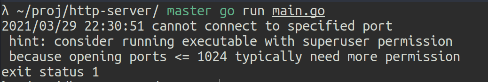

2. زمانی که دسترسی لازم را می‌دهیم

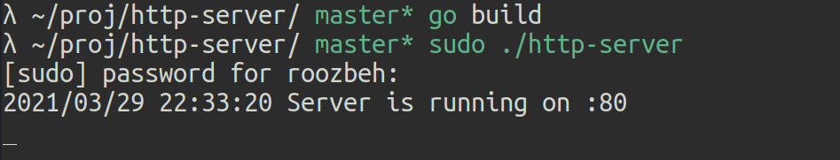

3. اجرای سرور روی پورتی غیر از پورتهای ۱ تا ۱۰۲۴ 

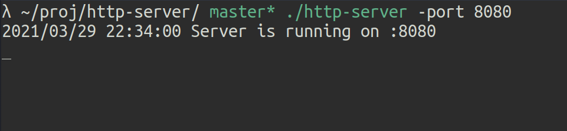

4. درخواست صحیح از طریق curl

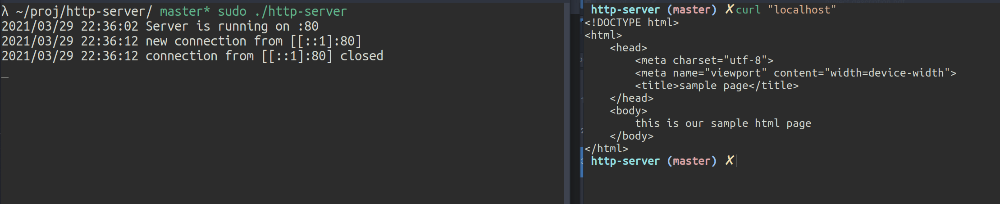

5. درخواست از طریق curl با حالت verbose: نمایش کامل هدرهای ارسالی و دریافتی

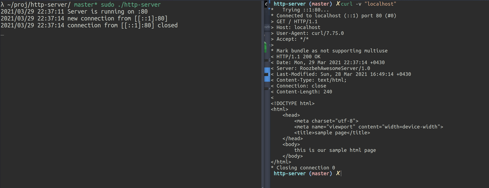

6. درخواست یک فایل خاص (نه پوشه) با حالت verbose

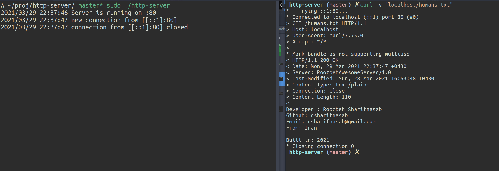

7. استفاده از پورت به‌خصوص 1234 بدون نیاز به sudo

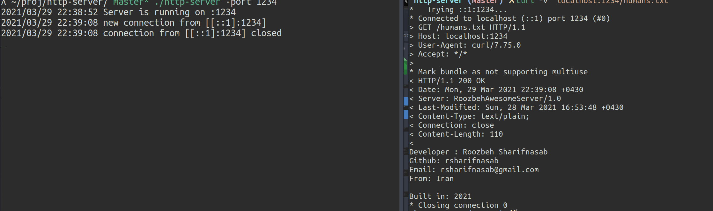

8. پیام ۴۰۴ دریافتی با curl با وارد کردن یک پوشه غلط

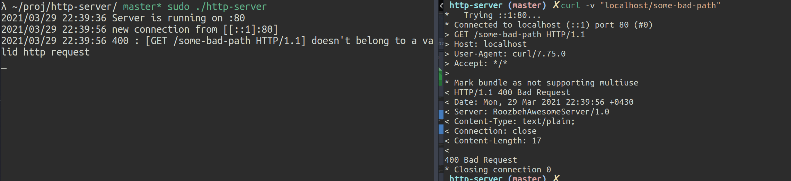

9. پیام ۴۰۴ دریافتی از curl با وارد کردن یک فایل غلط

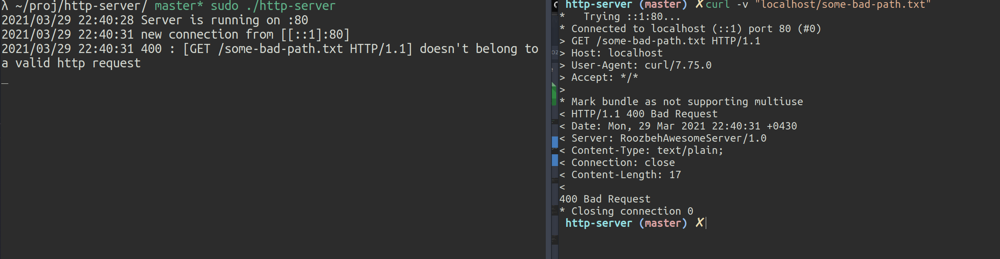

10.  چند درخواست پشت سر هم با یکبار اجرای سرور

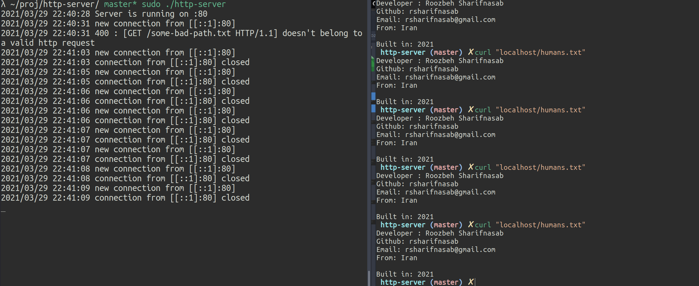

11. ارسال درخواست از طریق telnet و تایپ کردن مستقیم درخواست و گرفتن جواب

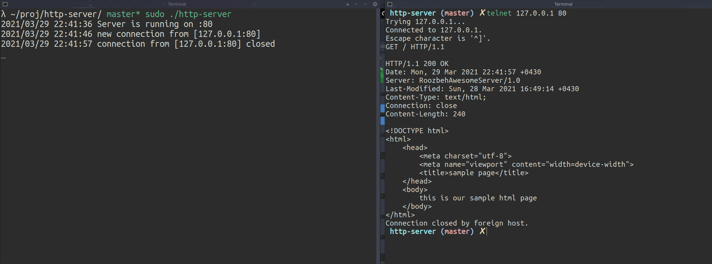

12. ارسال یک درخواست نامعتبر از طریق telnet و گرفتن پیام ۴۰۰

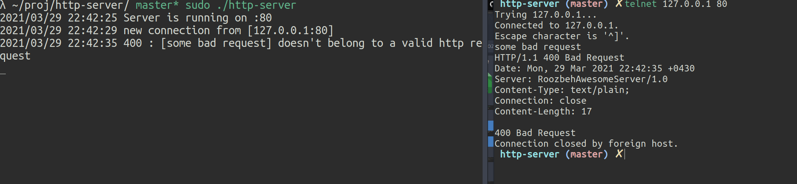

13. گرفتن و نمایش یک تصویر از طریق ابزار گرافیکی insomnia 

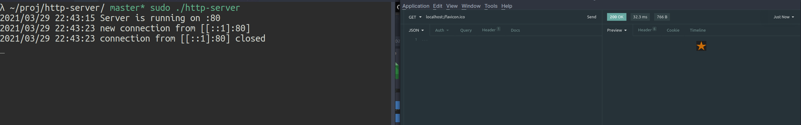

14. گرفتن html صفحه اصلی با insomnia

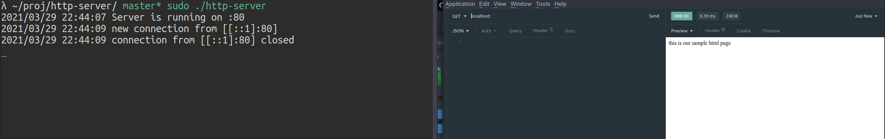

15. مشاهده‌ی هدرهای دریافتی از سمت سرور در ابزار insomnia

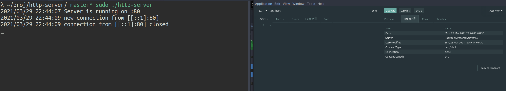

